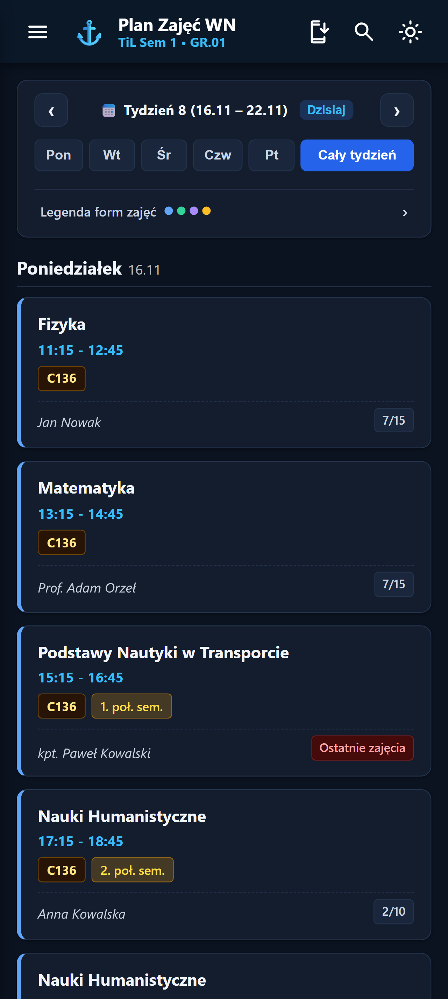
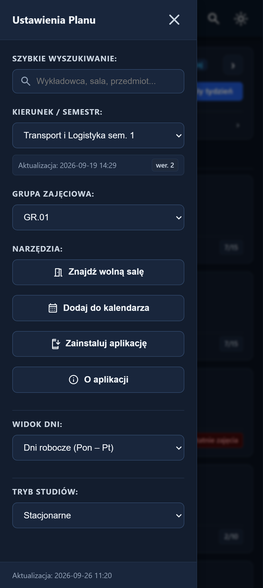
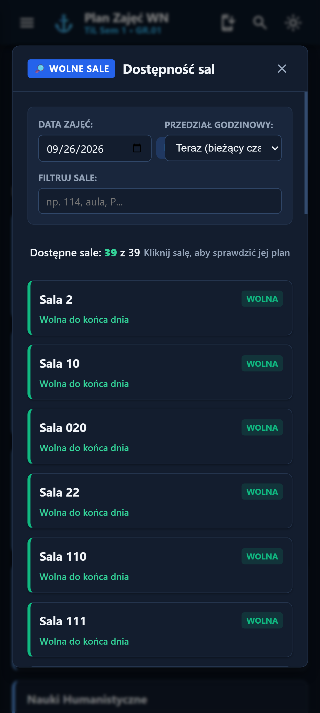

# Plan WN

[](https://github.com/Qu4X/planwn/actions)
[](LICENSE)
[](https://www.python.org/)
[](https://qu4x.github.io/planwn/)

An unofficial schedule viewer for students of the Faculty of Navigation at Gdynia Maritime University (UMG). It ingests schedule data from the university's systems and displays it in a fast, mobile-friendly progressive web app (PWA).

🔗 **Live app:** https://qu4x.github.io/planwn/

<p align="center">
  
  
  
</p>

## Table of Contents

- [Features](#features)
- [Architecture](#architecture)
- [Requirements](#requirements)
- [Local Setup](#local-setup)
- [Configuration](#configuration)
- [Testing](#testing)
- [Deployment](#deployment)
- [Data Source](#data-source)
- [Contributing](#contributing)
- [License](#license)

---

## Features

- **Full-time & Part-time plans**: Switch seamlessly between full-time (*stacjonarne*) and part-time (*niestacjonarne*) study schedules.
- **Meeting counting & progress**: Displays the current meeting index and total for recurring classes (e.g. meeting 3 of 7).
- **Academic calendar sync**: Rector day swaps, public holidays, and teaching breaks automatically adjust the timetable. Day swaps are appropriately bypassed for part-time dated plans.
- **Didactic form highlights & legend**: Classes color-coded by form (Lecture, Exercises, Laboratory, Simulator) with an expandable WCAG-compliant legend.
- **Calendar export**: Subscribe directly to personal group schedules via `webcal://` or download `.ics` calendar files.
- **Cross-reference system**: Inspect full weekly timetables for any instructor, room, or subject, complete with syllabus links.
- **Free room finder**: Search available classrooms at any date and time with real-time occupancy calculation.
- **PWA support**: Installable on Android, iOS, and desktop with offline support.

---

## Architecture

```
build_static.py            Build entry point. Fetches and parses full-time and part-time
                           schedules, builds cross-reference indexes, and writes to dist/.

arktur_client.py           Network client for scraping Arktur HTML schedules.
arktur_parser.py           Stateless HTML parser for university grid schedules.
nst_client.py              Network client for downloading part-time study timetable PDFs.
nst_parser.py              Spatial PDF timetable parser for part-time schedules.
ics_export.py              RFC 5545 iCalendar generator with academic calendar support.
scrapper.py                Backward-compatibility facade uniting scraper modules.
models.py                  Domain TypedDict type definitions.

data/                      Reference data and manual overrides.
├── academic_calendar.json Single source of truth for day swaps, holidays, and breaks.
├── subjects_manual.json   Manual abbreviation mappings for subject names.
├── forms_manual.json      Manual overrides for didactic lesson forms.
├── wn_curriculum_forms.json Official Faculty syllabus hourly quotas.
└── wn_subjects_catalog.json Official Faculty subject syllabus metadata.

tests/                     Unit and regression test suites.
├── test_backend.py        Python regression suite (168 tests).
├── test_calendar.js       JavaScript TDD suite for meeting-counting and UI logic.
├── test_cross_reference.js Unit tests for cross-reference indexing and search.
├── test_schedule_engine.js Unit tests for core schedule resolution engine.
└── strpza6_response.txt   Real HTML test fixture for scraper regression.

web/                       Vanilla JS PWA frontend (HTML5, modern CSS, zero build tools).
dist/                      Production build output deployed directly to GitHub Pages.
.github/workflows/         CI/CD workflow running daily at 04:00 UTC and on git push.
```

---

## Requirements

- Python 3.11 or later
- Node.js 18 or later (for JavaScript test suites)

Install Python dependencies:

```bash
pip install -r requirements.txt
```

Dependencies: `requests`, `beautifulsoup4`, `icalendar`, `pdfplumber`.

---

## Local Setup

1. Create and activate a virtual environment:

   ```bash
   python -m venv .venv
   # Windows
   .venv\Scripts\activate
   # macOS / Linux
   source .venv/bin/activate
   ```

2. Install dependencies:

   ```bash
   pip install -r requirements.txt
   ```

3. Run a test build (limited to 3 plans, so the build finishes in seconds instead of minutes — useful for quick iteration):

   ```bash
   python build_static.py --limit 3
   ```

4. Serve the output directory:

   ```bash
   python -m http.server 8080 --directory dist
   ```

5. Open `http://localhost:8080` in your browser.

For a full build of all plans, run `python build_static.py` without the `--limit` flag.

---

## Configuration

All configuration and reference catalogs reside in the [`data/`](data/) directory:

| File | Purpose |
|------|---------|
| `data/academic_calendar.json` | Rector day swaps, public holidays, and semester teaching breaks. |
| `data/subjects_manual.json` | Maps raw abbreviations to full human-readable subject names. |
| `data/forms_manual.json` | Overrides didactic lesson form classification (e.g. simulator vs. lab). |
| `data/wn_curriculum_forms.json` | Hourly quotas per major/semester for automatic form classification. |
| `data/wn_subjects_catalog.json` | Enriches subject views with degree majors and syllabus URLs. |

---

## Testing

Run tests before committing any changes.

### Python regression suite

```bash
# Windows
.venv\Scripts\python.exe tests/test_backend.py
# macOS / Linux
python tests/test_backend.py
```

### JavaScript test suites

```bash
node tests/test_calendar.js
node tests/test_cross_reference.js
node tests/test_schedule_engine.js
```

---

## Deployment

The `.github/workflows/` CI/CD pipeline runs automatically on every push to `main` and on a daily schedule (04:00 UTC) to keep schedules up to date. Each run executes `build_static.py`, then publishes the contents of `dist/` to GitHub Pages. No manual deployment steps are required.

---

## Data Source

Schedule data originates from [arktur.umg.edu.pl](https://arktur.umg.edu.pl/planyzaj/strpza5.php). This project is community-maintained and is not officially affiliated with Gdynia Maritime University.

---

## Contributing

Contributions are welcome:

1. Fork the repository and create a feature branch.
2. Make your changes, keeping the frontend build-tool-free (vanilla HTML/CSS/JS).
3. Run the full test suite (Python + JavaScript, see [Testing](#testing)) before opening a PR.
4. Open a pull request describing the change and its motivation.

If you spot incorrect schedule data, check `data/subjects_manual.json` and `data/forms_manual.json` first — most classification issues are fixed there rather than in code.

---

## License

This project is licensed under the [MIT License](LICENSE) — see the LICENSE file for details.
